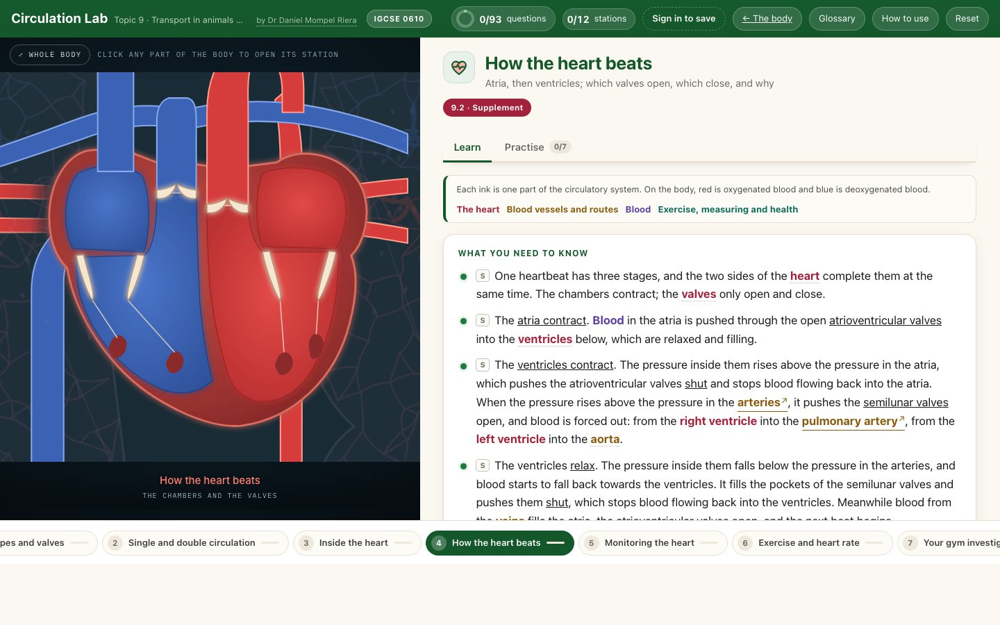

<div align="center">

<h1>🫀 &nbsp;Circulation Lab</h1>

**Cambridge IGCSE Biology 0610 · Topic 9, Transport in animals**

[](https://nlcsbiology.com/circulation-lab/)


by **Dr Daniel Mompel Riera** · NLCS Jeju

</div>



---

## What a student does

Click a part of the body and work through what it does: the theory in the wording the exam wants,
the pictures from the lessons, animations that stop at every step until the reader is ready, and
questions that say right or wrong — never the answer.

|  |  |
|---|---|
| 🫀 **12 stations** | the circulatory system · single and double circulation · the heart · one heartbeat · monitoring the heart · exercise and heart rate · your gym investigation · coronary heart disease · arteries, veins and capillaries · the main blood vessels · what blood is made of · clotting |
| ✍️ **97 questions** | fill the gaps · multiple choice · put in order · match up · sort into groups · **click the heart** |
| 🩸 **The body is the map** | a real anatomical drawing of the whole circulation (public domain, from Gray's Anatomy and Sobotta): blood flows along every vessel, away from the heart in the arteries and back in the veins, surging with each beat; each station lights and flies to the part it teaches, the heart stations open a magnified heart that beats, and you can zoom, drag and pull back to the whole body |
| ▶️ **Animations that wait** | one heartbeat, valve by valve, with the two heart sounds; a journey from artery to vein; a real heart in 3D; blood after a meal, from the gut through the liver; why the heart rate rises in exercise; a blocked coronary artery; a phagocyte at work; a cut clotting — every step holds until **Next step** |
| 🧭 **Trace the route** | the same body again: click the vessels, chambers and organs in the order the blood passes through them, from a kidney to the lungs or from the small intestine to the heart |
| 📝 **The gym investigation, not done for them** | the station says what the task is, what is handed in and how it is marked, gives the rules for a perfect results table and graph, and links every part of the report to the Write-Up Lab — but it writes no research question, method, table or graph for them, because those are the assessment |
| 📖 **A shared glossary** | one wording per term, the same in every lab |

> [!NOTE]
> **The answers are not in the page — at all.** The lab can tell a student they are wrong, but
> nothing in it knows what *right* is. How that works is explained below.

## Where it sits

Behind the [Human Body Hub](https://nlcsbiology.com/human-body-hub/), one shelf of the
[Biology Hub](https://nlcsbiology.com/biology-hub/) — the front door to every Biology app here.
The **← The body** button goes back up.

<details>
<summary><b>Behind the scenes</b> — how this lab works, in plain English</summary>

<br>

**The body is a real anatomical drawing.** Mariana Ruiz Villarreal's *Circulatory System*
(LadyofHats, public domain), drawn from Gray's Anatomy and the Sobotta atlas — the same artist as
the Digestion Lab's body. Nothing on it is placed by hand: the blood flows along the centre line of
every vessel she drew, traced from the drawing itself, and the vessels are named from the arrow tips
of her own labelled version. Red is oxygenated blood and blue is deoxygenated blood, as on every
diagram, and the lab says that real blood is never blue.

**Why the answers are not in the page.** Each question carries a *scrambled fingerprint* of its
answer. When a student answers, the page scrambles what they did in the same way and compares the
two. Scrambling only works one way, so nothing in the page can say what the right answer is — only
*not that one*. The real answers live in one file that is never published.

**What is shared with the other labs.** The question engine, the marking, the saving, the sign-in,
the widgets and the glossary are kept in one place and copied in whenever a lab is rebuilt, so a fix
reaches every lab at once. What belongs to this lab alone is its content and its drawings.

**Rebuilding it** (only needed if you change the content). One command reads the master file with
the answers in it and writes out the published version with only the fingerprints. It refuses to
finish unless every answer still marks correctly.

```
node tools/build.mjs
```

Picture, video and sound credits: [`assets/photos/CREDITS.md`](assets/photos/CREDITS.md).

</details>

Made by **Dr Daniel Mompel Riera** · Biology, NLCS Jeju ·
[dmompelriera@nlcsjeju.kr](mailto:dmompelriera@nlcsjeju.kr)

## Licence

| What | Licence |
|---|---|
| **The software** — everything that runs: JavaScript, HTML structure, CSS, build tools | [AGPL-3.0](LICENSE) |
| **The teaching material** — question text, explanations, diagrams and images I made, wherever they are stored | [CC BY-NC-SA 4.0](LICENSE-CONTENT) |

**In plain English.** Use it, change it, run it for your students — free, and you never need to ask.
If you change the software and let anyone else use it, *including over a network*, you have to publish
your source under the same licence. You may not sell the teaching material or use it commercially, and
the credit has to stay.

**Not covered:** third-party images and media keep their own licences — see the picture credits.

© 2026 Dr Daniel Mompel Riera. I hold the copyright, so I can grant other terms: if you want to use any of
this commercially, ask me at <dmompelriera@nlcsjeju.kr>.
